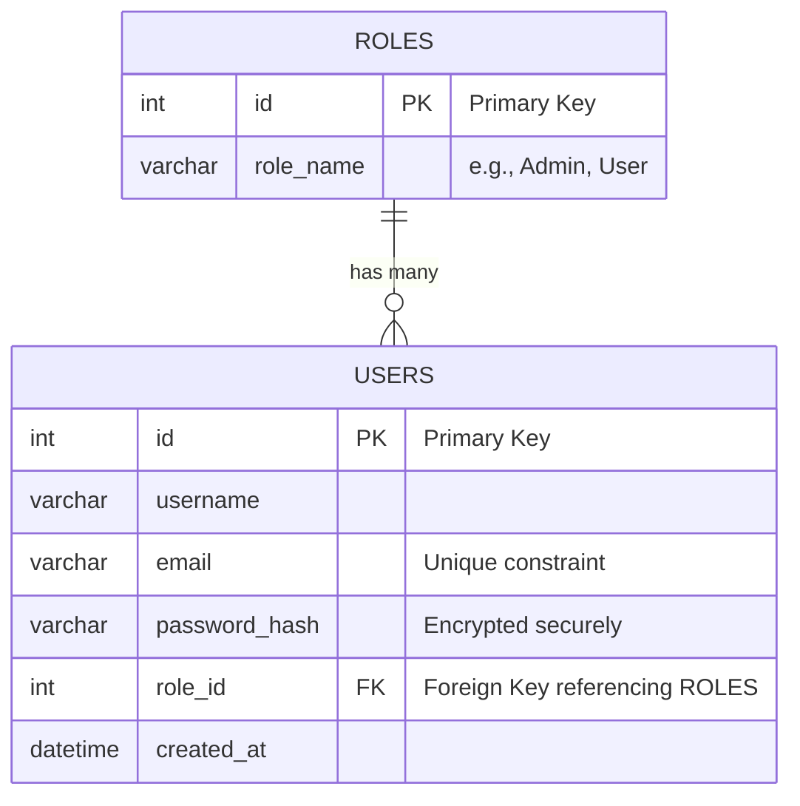

# Apex Portfolio - Task 3 (Database Architecture & Authentication)

This repository contains the backend implementation for Task 3, focusing on database design, user authentication, role-based access control, and robust security practices using PHP and MySQL.

## 1. Database Design & Normalization

The database for this project was designed with security and efficiency in mind, completely adhering to strict normalization rules up to the **Third Normal Form (3NF)**.

### Entity-Relationship (ER) Diagram

### Normalization Proof
1. **First Normal Form (1NF):** Every column holds atomic (single) values. There are no repeating groups or arrays. Each table is identifiable by a unique Primary Key (`id`).
2. **Second Normal Form (2NF):** The tables are in 1NF, and all non-key attributes are fully functionally dependent on the entire primary key. Since our primary keys are single columns, there are no partial dependencies.
3. **Third Normal Form (3NF):** The tables are in 2NF, and there are no transitive dependencies. Instead of storing the user's role string (e.g., "Admin") directly in the `users` table, which would cause redundancy, it is extracted into a separate `roles` table and referenced via the `role_id` Foreign Key.

## 2. Core Features Implemented

*   **Secure Authentication System:** Complete Login, Logout, and Registration flow.
*   **Role-Based Access Control (RBAC):** Users are restricted to standard views, while Admins have exclusive access to the hidden `admin.php` dashboard.
*   **Admin Dashboard (CRUD):** Admins can Create, Read, Update, and Delete users directly from the UI.
*   **Live AJAX Email Validation:** The registration form communicates asynchronously with the backend to verify if an email is already registered in real-time.

## 3. Security Measures (Defense in Depth)

*   **SQL Injection Prevention:** Every database query involving user input utilizes **Prepared Statements** (`mysqli_prepare`).
*   **Password Encryption:** All user passwords are encrypted using PHP's native `password_hash()` (bcrypt algorithm) before being stored in the database. Validation is handled safely via `password_verify()`.
*   **Server-Side Validation:** All forms (login, register, create user, update user) utilize strict server-side validation, including `filter_var()` to guarantee correct email formats, ensuring malicious actors cannot bypass frontend HTML validations.
*   **XSS Protection:** Output sanitization (`htmlspecialchars`) is utilized when displaying dynamic data to prevent Cross-Site Scripting.
